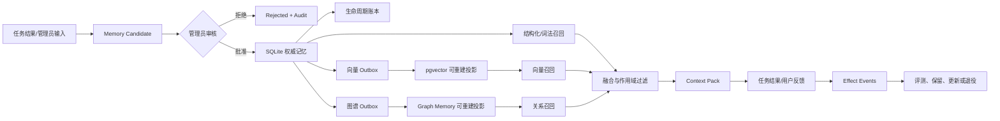

# 真实记忆效果与生命周期生产闭环方案

> 文档状态：执行中（阶段 A、B 与联合阶段 0、1 已完成，下一阶段为 C）  
> 基线日期：2026-09-20  
> 适用系统：`agent-system` / Command Center / OpenClaw Graph Memory  
> 核心目标：把“记忆已写入”升级为“可证明地写入、可召回、有效果、可更新、可退役、可审计、可回滚”。
> 协同契约：`SYSTEM-COORDINATED-OPTIMIZATION-PLAN.md`

## 1. 执行结论

当前不需要重建 pgvector 或图谱服务。真实运行环境复测表明，结构化、词法、向量和图谱四条检索通道均可用；当前的主要缺口是：

1. `weighted-rrf.v1` 仍处于 `shadow`，线上继续使用基线排序；
2. 35 条评测用例仍全部是草稿，人工激活为 0，离线质量门禁没有可信真值；
3. Shadow 样本只有 36 次，尚未达到 100 次真实查询的最低门槛；
4. 诊断进程如果没有加载仓库根目录 `.env`，会把健康通道误报为 `not_configured` 或 `degraded`；
5. 生命周期状态机已经建立，但仍需把生产投影对账、退役验证、效果反馈和持续告警固化为常态机制。

因此，本方案的中心不是继续增加存储层或检索算法，而是完成“配置一致性 → 投影一致性 → 人工真值 → Shadow 门禁 → 显式切流 → 生命周期与效果反馈”的生产闭环。

### 阶段进度

| 阶段 | 状态 | 验收记录 |
| --- | --- | --- |
| A 诊断一致性与基线冻结 | 已完成 | `MEMORY-PRODUCTION-CLOSURE-PHASE-A.md` |
| 0 跨域权威与上下文契约 | 已完成 | `SYSTEM-COORDINATED-PHASE-0.md` |
| B 权威记忆与双投影一致性 | 已完成 | `SYSTEM-COORDINATED-PHASE-1.md` |
| C 人工真值与安全负例闭环 | 待执行 | — |
| D 离线评测与 Shadow 在线证据 | 待执行 | — |
| E 显式切流与回滚演练 | 待执行 | — |
| F 生命周期常态化与真实效果反馈 | 待执行 | — |
| G 验收器严重级别加固 | 待执行 | — |

## 2. 已确认的真实基线

### 2.1 One-Sim 记忆闭环

- 8 条候选已经管理员审核并发布；
- 4 条进入 `project_context_memories`，4 条进入 `agent_memories`；
- 8 条 `memory_lifecycle_records` 均为 `active`；
- 8 个向量索引任务均为 `completed`；
- 8 个图谱 Outbox 事件均为 `delivered`；
- 实际查询能够召回纠正后的“One-Sim 网站独立仓库与发布边界”记忆。

### 2.2 向量基础设施

使用生产配置、在真实本机环境执行严格预检后的结果：

| 项目 | 当前值 |
| --- | --- |
| PostgreSQL | 17.10，状态正常 |
| pgvector | 0.8.6，扩展已安装 |
| 投影表 | `approved_memory_vectors` 已就绪 |
| 当前向量投影 | 17 条 |
| Embedding | Ollama `nomic-embed-text:v1.5` |
| 维度 | 768，探测一致 |
| 向量任务队列 | 26 条，全部完成 |
| 向量开关 | `MEMORY_VECTOR_ENABLED=true` |
| 融合模式 | `MEMORY_HYBRID_FUSION_MODE=shadow` |

### 2.3 真实四通道召回

对“One-Sim 网站应该放在哪里，发布前有哪些边界？”执行不持久化查询：

| 通道 | 结果 |
| --- | --- |
| 已审核结构化记忆 | `ready`，4 条 |
| pgvector | `ready`，4 条，89.66ms |
| Graph Memory | `ready`，4 条，0 条被过滤 |
| 生效通道 | structured、lexical、vector、graph |
| 多通道共同候选 | 4 条 |
| 当前服务排序 | `score-sort-baseline` |
| 候选排序 | `weighted-rrf.v1` |
| 图谱默认模式 | `rerank` |

### 2.4 效果门禁基线

| 项目 | 当前值 | 目标 |
| --- | ---: | ---: |
| Shadow 查询 | 36 | ≥ 100 |
| Shadow 正常 | 35 | 持续满足可用率门槛 |
| Shadow 降级 | 1 | 查明原因且观察窗内达标 |
| 评测草稿 | 35 | 作为人工审核候选池 |
| 激活人工真值 | 0 | ≥ 30 |
| 进行中审核批次 | 1 | 完成 30/30 |
| 权威来源覆盖 | 尚未形成激活覆盖 | 所有权威来源至少 1 条 |

### 2.5 诊断误报说明

未加载 `.env` 的临时 Python 进程会将向量通道显示为 `not_configured`；受限沙箱又会阻止本机 Unix Socket 和 `127.0.0.1` 访问，从而把 PostgreSQL、Ollama 和 Graph Memory 误报为不可用。

后续所有生产诊断必须同时记录：

- 配置文件来源；
- 配置指纹，不输出密钥；
- 是否处于受限沙箱；
- 实际运行用户与工作目录；
- PostgreSQL、Ollama、Graph Memory 的真实探测结果；
- 3021 服务进程实际加载的开关值。

## 3. 目标架构与权威边界



必须长期保持以下边界：

1. SQLite 中的 `profile_facts`、`project_context_memories`、`agent_memories` 是权威内容；
2. pgvector 和 Graph Memory 都是可重建投影，不得反向覆盖权威内容；
3. 未审核候选、原始对话和临时推理不得进入正式投影；
4. 作用域过滤必须发生在融合前和注入 Context Pack 前；
5. 向量或图谱失效时允许降级，但必须显式记录健康状态；
6. 排序切换、记忆发布、冲突裁决和删除必须保留人工门禁与审计记录。

### 3.1 与 Agent Team 的协同边界

Agent Team 不增加新的长期记忆作用域。长期权威记忆仍只有 Profile、Project、Agent 三类；Team、Role、AgentInstance、SharedTask、TaskClaim 和 AgentMessage 均属于运行上下文。

记忆进入团队执行时必须形成绑定 SharedTask、TaskClaim 和 WorkRun 的不可变 Context Pack 快照。快照保存 `mission_id`、`team_id`、`agent_instance_id`、`shared_task_id`、`claim_id`、`work_run_id`、检索策略、允许作用域和 `memory_source_ref`。实例换人时不得直接继承旧实例的私有线程或失效 Claim 的授权上下文。

原始 AgentMessage、临时推理和实例线程不能直接发布为长期记忆，只能在形成证据充分的 Memory Candidate 并通过既有审核后进入权威记忆。

## 4. 分阶段执行方案

## 阶段 A：诊断一致性与基线冻结

目标：消除“同一系统因启动方式不同而得出不同健康结论”的问题。

### 工作项

1. 为预检和运维脚本统一增加显式配置加载：
   - 默认从仓库根目录 `.env` 加载；
   - 支持 `--env-file`；
   - 输出配置来源和脱敏配置指纹；
   - 不允许输出数据库密码、HMAC 密钥或完整连接串。
2. 增加运行环境标识：`native`、`sandboxed`、`container`。
3. 将“配置未启用”和“网络被执行环境阻断”拆成不同错误码。
4. 让 3021 健康端点返回脱敏后的有效配置摘要：
   - vector enabled；
   - embedding 模型与维度；
   - fusion mode；
   - graph mode；
   - 配置加载时间和配置指纹。
5. 固化本文件第 2 节基线快照，后续每阶段更新差异，不覆盖历史证据。

### 重点修改位置

- `backend/scripts/memory_vector_preflight.py`
- `backend/services/context_retrieval_service.py`
- `backend/routers/monitoring_router.py`
- 3021 launchd 启动配置及其测试

### 验收标准

- 从 launchd、项目终端和运维脚本得到相同的有效配置摘要；
- 受限沙箱探测失败时返回 `environment_restricted`，不再误报为服务未安装；
- 不加载 `.env` 的测试能够明确失败，而不是静默进入另一套配置；
- 敏感信息泄漏测试通过。

### 回滚

仅增加诊断字段和错误分类，不改变检索排序；异常时回滚新增输出，保留原健康检查。

## 阶段 B：权威记忆与双投影一致性

目标：证明每条 `active` 权威记忆在向量和图谱投影中都存在、内容一致、作用域一致；非 `active` 记忆没有可服务残留。

### 工作项

1. 运行现有向量回填与对账：

```bash
backend/venv/bin/python backend/scripts/backfill_memory_vectors.py \
  --max-wait-seconds 120 --batch-size 20
```

2. 新增统一只读对账工具 `memory_projection_reconcile.py`，输出：
   - 权威 `active` 数量；
   - pgvector 缺失、孤儿、哈希漂移、模型/维度错误；
   - Graph Memory 缺失、孤儿、正文哈希漂移、作用域漂移；
   - Outbox 积压、重试和死信；
   - 生命周期账本与权威状态不一致；
   - 按 `source_ref` 的可审计差异清单。
3. 扩展 Graph Memory 运维状态，增加规范来源集合对账，而不只检查 Outbox 是否投递。
4. 对 One-Sim 新发布的 8 条记忆执行定向对账。
5. 对 `superseded`、`expired`、`tombstoned` 各执行一个隔离演练，确认：
   - 结构化召回为 0；
   - pgvector 投影被删除；
   - 图谱投影被退役；
   - 生命周期事件和尝试审计完整。

### 验收标准

| 指标 | 要求 |
| --- | ---: |
| active 权威记忆缺失投影 | 0 |
| 非 active 记忆可服务残留 | 0 |
| 孤儿投影 | 0 |
| 内容哈希漂移 | 0 |
| 作用域漂移 | 0 |
| 向量死信 | 0 |
| 图谱死信 | 0 |
| One-Sim 8 条定向对账 | 8/8 |

### 回滚

对账工具默认只读。修复动作必须生成待审批计划；不得自动删除权威记忆。投影可通过 Outbox 或全量回填重建。

## 阶段 C：人工真值与安全负例闭环

目标：把现有 35 条草稿转化为至少 30 条可信、可审计的人工评测真值。

### 工作项

1. 完成批次 `memory-eval-batch-2417c72342cde48e` 的 30 条人工审核。
2. 每条用例必须逐项核对：
   - 问法已改写为真实业务表达；
   - `user_id`、`project_id`、`agent_id` 作用域正确；
   - 期望来源与原文证据一致；
   - 禁止来源包含必要的跨用户、跨项目、已过期或冲突反例；
   - 来源快照没有发生漂移；
   - 置信度由审核者明确选择。
3. AI 提案只用于填充待编辑表单，不得自动勾选、保存或激活。
4. 至少覆盖：
   - 所有权威记忆来源；
   - canonical、natural、terse、contextual、boundary 五类问法；
   - 至少 1 条经人工确认的安全负例；
   - 用户、项目和智能体三类隔离场景。
   - 跨 Team、跨实例私有线程、失效 Claim、换人继承和原始消息污染五类团队安全负例。
5. 对重复、模糊或无法形成唯一真值的草稿归档，不为凑数激活。

### 验收标准

- 人工激活用例 ≥ 30；
- 30 条均完成三项审核清单；
- 所有权威来源均至少有 1 条激活用例；
- 至少 1 条安全负例，建议不少于 5 条；
- `automatic_activation=false`；
- 数据集哈希稳定，审核后没有未追踪编辑。

### 独立的 80 条证据门禁

30 条用于 RRF 排序晋级；80 条人工复核基线用于更高层的总体效果/自动发布门禁。两者不能混为同一个完成条件。完成首批 30 条后，再按风险与来源覆盖扩充到 80 条，并补齐完整 Top-5 相关性标注，使 Precision@5 可计算。

## 阶段 D：离线评测与 Shadow 在线证据

目标：同时满足离线正确性和在线稳定性，生成唯一的 `promotion_ready` 建议。

### D1. 离线评测

对已激活数据集运行 Baseline 与 `weighted-rrf.v1` 对比，强制门禁：

| 指标 | 要求 |
| --- | ---: |
| 激活人工用例 | ≥ 30 |
| Forbidden Hits | 0 |
| Recall 下降 | 0 |
| Item Recall 下降 | 0 |
| MRR 下降 | ≤ 0.02 |
| 评测中的通道降级 | 0 |
| 数据集哈希 | 与最新激活数据一致 |

同时运行统一效果门禁：

```bash
backend/venv/bin/python \
  backend/scripts/memory_effectiveness_integrated_gate.py --summary-only
```

必须继续覆盖 recall、abstention、update、conflict、expiry、forget、user isolation、project isolation 和 agent isolation 九类场景。

### D2. Shadow 在线观察

保持 `MEMORY_HYBRID_FUSION_MODE=shadow`，只让真实业务查询积累事件，不使用脚本制造虚假样本。

| 指标 | 要求 |
| --- | ---: |
| 真实 Shadow 查询 | ≥ 100 |
| 观察窗口 | 建议 3–7 天 |
| 向量可用率 | ≥ 99% |
| 向量检索 P95 | ≤ 300ms |
| Context Pack 总延迟 P95 | ≤ 800ms |
| 当前 1 条降级事件 | 必须归因并确认不在有效观察窗持续复现 |

Top-1 变化率、Top-K 重合率和平均排名位移只用于诊断，不能在缺少人工真值时独立决定切流。

### 验收标准

- `online_observation_passed=true`；
- 最新离线评测通过；
- 数据集哈希未漂移；
- `promotion_ready=true`；
- `automatic_switch_performed=false`，保持人工决策。

## 阶段 E：显式切流与回滚演练

目标：在完整证据和人工批准后，将服务排序从基线切换到 `weighted-rrf.v1`，并证明可以快速回滚。

### 切流前置条件

1. 阶段 A–D 全部完成；
2. 发布候选通过 `memory_release_gate`；
3. 变更创建人与批准人分离；
4. 完成数据库备份和当前配置快照；
5. 3021、专用 worker、PostgreSQL、Ollama、Graph Memory 均健康；
6. 明确维护窗口和回滚负责人。

### 切流动作

1. 将 `MEMORY_HYBRID_FUSION_MODE` 从 `shadow` 改为 `weighted_rrf`；
2. 重启 3021 服务和相关 worker；
3. 校验健康端点显示 `served_strategy=weighted-rrf.v1`；
4. 执行已知、未知、跨项目、跨智能体、过期记忆五类在线冒烟；
5. 观察 30 分钟、2 小时、24 小时三个窗口。

### 切流后门禁

- Forbidden Hit 必须为 0；
- 跨作用域泄漏必须为 0；
- 向量和图谱降级率不超过既定阈值；
- P95 延迟不超过阶段 D 基线的 20%，且仍低于绝对上限；
- abstention 准确性不回退；
- 任务错误率和无依据断言不增加。

### 立即回滚条件

出现以下任一情况，立刻恢复 `shadow` 或基线模式并重启：

- 任意跨用户、跨项目或跨智能体泄漏；
- 任意 forbidden source 被注入 Context Pack；
- 生命周期已退役记忆重新出现；
- 连续 5 分钟向量/图谱不可用且任务质量受影响；
- Context Pack P95 > 800ms；
- 关键任务完成率显著下降；
- 配置指纹与批准版本不一致。

## 阶段 F：生命周期常态化与真实效果反馈

目标：让记忆不是“永久追加”，而是能基于证据更新、冲突裁决、到期、遗忘和评估效果。

### 工作项

1. 生命周期任务常态化：
   - worker 定时执行到期迁移；
   - 对 `pending`、`retry`、`dead_letter` 建立告警；
   - 对租约超时与重试次数建立可观测指标。
2. 建立“召回 → 使用 → 任务结果”效果链：
   - 记录被选入 Context Pack 的 `source_ref`；
   - 记录智能体是否引用或使用；
   - 关联 `mission_id`、`team_id`、`agent_instance_id`、`shared_task_id`、`claim_id` 和 `work_run_id`；
   - 关联任务验收结果、用户纠正和失败原因；
   - 区分“被召回但无帮助”“未召回导致失败”“错误召回导致失败”。
3. 建立记忆保留策略：
   - 决策/约束：默认长期保留，变更时版本化替换；
   - 项目状态：必须设置复核或到期时间；
   - 方法/经验：按实际效果定期复核；
   - 一次性执行状态：不进入长期记忆；
   - 删除请求：进入 tombstone，再按审计策略 purge。
4. 每周输出记忆效果报告：
   - 召回率与有效使用率；
   - false support；
   - 用户纠正率；
   - 过期/冲突/重复记忆；
   - 低效或从未使用记忆候选；
   - 各通道可用率与延迟。
5. 所有自动建议只生成候选，不自动修改权威记忆。

### 验收标准

- 更新、冲突、到期、遗忘四种生产级演练全部通过；
- 退役后结构化、向量、图谱三处残留均为 0；
- 任务结果能够关联到实际使用的记忆来源；
- 每周报告可重复生成；
- 所有状态迁移都有操作者、原因、前后状态和时间证据。

## 阶段 G：验收器严重级别加固（共享平台门禁）

该阶段与记忆系统有关，但不改变阶段 A–F 的中心工作。其最小 blocker 契约前置为 Agent Team 真实认领和记忆阶段 E 的共同门禁；其余验收器工程加固可以与阶段 B–F 并行完成。目标是防止“明确违反要求但总评仍通过”。

### 工作项

1. 将验收发现分为 `blocker`、`major`、`minor`、`info`；
2. 明确以下问题必须阻断通过：
   - 用户硬性约束未满足；
   - 安全、隐私、跨作用域泄漏；
   - WCAG AA 等明确验收阈值失败；
   - 必需工件缺失或不可追溯；
   - 测试报告与实际产物不一致；
3. 总分不能覆盖 blocker；存在 blocker 时最终状态只能是 `failed` 或 `needs_remediation`；
4. 修复后必须生成新验收版本，不得原地篡改旧结论；
5. 将严重级别规则写入回归测试与发布门禁。

## 5. 测试矩阵

| 类别 | 必测场景 | 通过条件 |
| --- | --- | --- |
| 配置 | launchd/CLI/运维脚本 | 配置指纹一致 |
| 权威性 | 未审核候选 | 任何通道均不可召回 |
| 用户隔离 | 用户 A 查询用户 B 记忆 | 0 命中 |
| 项目隔离 | 项目 A 查询项目 B 记忆 | 0 命中 |
| 智能体隔离 | 非目标智能体查询私有记忆 | 0 命中 |
| 团队隔离 | Team A 查询 Team B 运行上下文 | 0 命中 |
| 实例隔离 | 新实例继承旧实例私有线程 | 0 未授权继承 |
| Claim 失效 | 旧 Claim 使用 Context Pack 或回写 | 全部拒绝 |
| 消息治理 | 原始 AgentMessage 自动进入长期记忆 | 0 发布 |
| 换人恢复 | 故障实例替换 | 仅继承已确认事实、Artifact 与重新授权上下文 |
| 更新 | 新版本替换旧版本 | 仅新版本可召回 |
| 冲突 | 权威胜者与败者 | 胜者可用、败者被压制 |
| 到期 | `valid_until` 已到 | 三通道均不可服务 |
| 遗忘 | tombstone/purge | 正文不再可服务，审计仍合规 |
| 降级 | pgvector 不可用 | 结构化/词法继续工作并显式降级 |
| 降级 | Graph Memory 不可用 | 其他通道继续工作并显式降级 |
| 克制回答 | 无相关记忆 | `abstain`，false support=0 |
| 融合 | 多通道同一来源 | 正确去重并保留证据 |
| 回滚 | weighted RRF → shadow | 配置和服务均恢复 |

## 6. 运维命令清单

### 向量严格预检

```bash
backend/venv/bin/python \
  backend/scripts/memory_vector_preflight.py \
  --probe-embedding --require-infrastructure
```

### 向量回填与对账

```bash
backend/venv/bin/python \
  backend/scripts/backfill_memory_vectors.py \
  --max-wait-seconds 120 --batch-size 20
```

### 生命周期隔离演练

```bash
backend/venv/bin/python backend/scripts/memory_lifecycle_fixture.py
```

### 统一效果门禁

```bash
backend/venv/bin/python \
  backend/scripts/memory_effectiveness_integrated_gate.py --summary-only
```

### 线上系统门禁与五智能体矩阵

```bash
backend/venv/bin/python backend/scripts/memory_system_gate.py
backend/venv/bin/python backend/scripts/memory_system_matrix.py
```

### 发布治理

```bash
backend/venv/bin/python backend/scripts/memory_release_gate.py --help
```

涉及真实服务、PostgreSQL Unix Socket、Ollama 或 Graph Memory 网关的命令，必须在具备本机访问权限的运行环境中执行；受限沙箱结果只能用于验证降级路径，不能作为生产健康结论。

## 7. 指标与告警

### P0：立即告警

- 任意跨作用域泄漏；
- forbidden source 命中；
- tombstoned/purged 记忆被召回；
- 生命周期账本与权威表状态冲突；
- 图谱或向量死信包含关键/高重要度记忆。

### P1：高优先级

- 向量可用率低于 99%；
- 图谱检索 24 小时降级率超过 20%；
- 向量 P95 超过 300ms；
- Context Pack P95 超过 800ms；
- Outbox 持续积压超过 15 分钟；
- 配置指纹漂移。

### P2：趋势治理

- 某类记忆长期从未召回；
- 被召回但任务无收益的比例持续上升；
- 用户纠正率上升；
- 重复或冲突记忆增加；
- Top-1 变化率异常但尚未造成质量回退。

## 8. 计划排期与阶段产物

| 阶段 | 预计工作量 | 主要产物 | 是否改变线上排序 |
| --- | ---: | --- | --- |
| A 诊断一致性 | 0.5–1 天 | 配置指纹、错误分类、健康摘要 | 否 |
| B 双投影对账 | 1–2 天 | 统一对账工具、差异报告、退役演练 | 否 |
| C 人工真值 | 2–4 天人工审核 | ≥30 条激活真值、审核审计 | 否 |
| D 离线+Shadow | 3–7 天观察 | 评测报告、在线门禁、切流建议 | 否 |
| E 显式切流 | 0.5–1 天 | 变更记录、冒烟报告、回滚演练 | 是 |
| F 生命周期常态化 | 1–2 天 | 效果链、保留策略、周报与告警 | 否 |
| G 验收器加固 | 1–2 天 | blocker 规则、回归门禁 | 影响任务验收 |

阶段 C 与 D 的日历时间取决于真实人工审核和真实业务查询，不能用自动生成数据缩短。

## 9. 总体验收定义

只有同时满足以下条件，才可宣布“真实记忆效果与生命周期闭环完成”：

- [ ] 权威记忆、生命周期账本、pgvector、Graph Memory 四方对账为 0 差异；
- [ ] 未审核、过期、冲突败者、已遗忘记忆均不可召回；
- [ ] 至少 30 条人工真值通过排序晋级门禁；
- [ ] 至少 100 次真实 Shadow 查询达到可用率和延迟门槛；
- [ ] `promotion_ready=true` 且由独立管理员批准切流；
- [ ] `weighted-rrf.v1` 上线后通过 24 小时观察；
- [ ] 回滚演练完成；
- [ ] 召回来源能够关联任务结果和用户反馈；
- [ ] 更新、冲突、到期、遗忘四类生命周期路径可审计；
- [ ] P0/P1 告警和每周效果报告生效；
- [ ] 80 条总体效果基线完成人工复核，Precision@5 可计算；
- [ ] 验收器不会让 blocker 被总分掩盖。

## 10. 建议的立即执行顺序

1. 先执行阶段 A，固化配置加载和诊断契约；
2. 已完成协同阶段 0，冻结跨域权威、Context Pack 和效果归因契约；
3. 随即执行阶段 B，对当前权威/投影数据做全量对账；
4. 与 Agent Team 阶段 1 并行，但在联合隔离门禁通过前不启用真实共享任务认领；
5. 并行启动阶段 C 的人工审核，但不自动激活；
6. 在真实查询自然积累到 100 条期间完成离线评测准备；
7. 阶段 D 全部通过后，单独提交阶段 E 的人工切流审批；RRF 首次切流不得与 Agent Team 首次真实认领安排在同一维护窗口；
8. 切流稳定后完成阶段 F；
9. 最小 blocker 契约在真实认领前生效，其余阶段 G 工程加固与阶段 B–F 并行完成。
